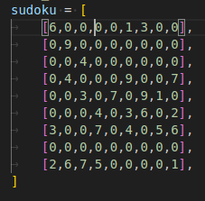

# Sudoku_Solver
<a name="readme-top"></a>

<!-- TABLE OF CONTENTS -->
<details>
  <summary>Table of Contents</summary>
  <ol>
    <li>
      <a href="#about-the-project">About The Project</a>
      <ul>
        <li><a href="#built-with">Built With</a></li>
      </ul>
    </li>
    <li>
      <ul>
        <li><a href="#prerequisites">Prerequisites</a></li>
      </ul>
    </li>
    <li><a href="#Execution">Execution</a></li>
    <li><a href="#Annex">Annex</a></li>
  </ol>
</details>


<!-- ABOUT THE PROJECT -->
## About The Project

This is a python project. The aim is to find a solution for a given sudoku grid.

<p align="right">(<a href="#readme-top">back to top</a>)</p>

### Built With


<p align="right">(<a href="#readme-top">back to top</a>)</p>

## Execution

* First you have to fill sudoku grid with your own numbers

* Than we execute the program
```
	python3 sudoku_resolver.py
```

* Execution have been maunally slowed down to see reel effects
## Annex

For better perfs it only works with 9 x 9 grid

<p align="right">(<a href="#readme-top">back to top</a>)</p>